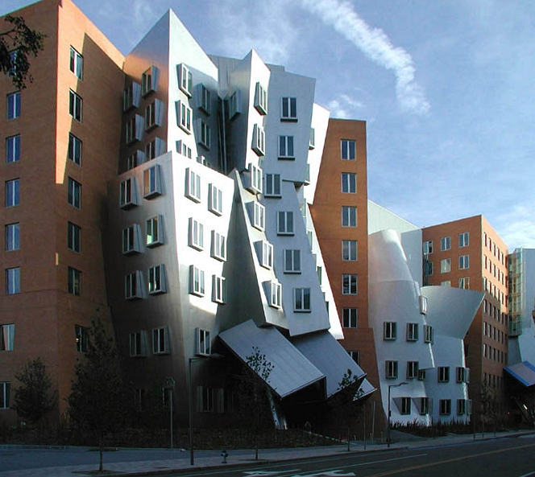
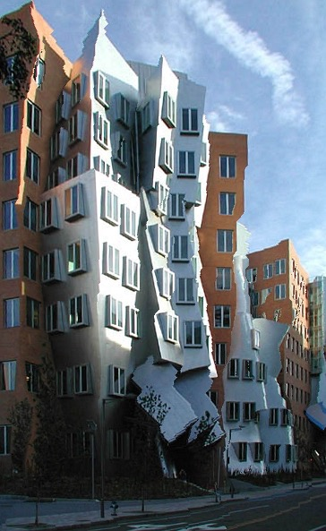

# Image Seam

This is an implementation of the [seam carving](https://en.wikipedia.org/wiki/Seam_carving) algorithm. The seam carving algorithm removes the most insignificnat pixles from an image without disturbing the general theme of the picture.

## Example

Here we have an image of the Stata Center, MIT:



We then shrink it to around half in width:



Notice that the overall structure of the building hasn't been changed.

## Efficiency

The implementation provided in the following code has a higher time and space efficiency than any previous implementations. Compared to previous implementaions by other users (See ``vendor/``), this implementaion has achieved at least 6 times speed up and a lot less memory. The strategy used in this implementaion is that data and space are reused in multiple iterations. We also use various parsers accelerate the computation.

## Installation

All the codes provided are written in [Julia](https://github.com/JuliaLang/julia) and displayed in [jupyter notebook](https://github.com/JuliaLang/IJulia.jl). You may clone this directory and enter the following code in Julia:

```julia
using IJulia
notebook()
```

Then you can find the location of this notebook ``Image_Seam.ipynb`` and run it.

##Acknowledgement

This project is inspired by MIT professor [Alan Edelman](http://math.mit.edu/~edelman/awards.php) ([Github](alanedelman)) during the winter break, 2018. Professor Edelman also kindly offered some Julia implementations of the seam carving algorithm. 

I should also thank [Jessica Tang]( https://github.com/jynnie) for helping me with getting used to the Github environment. This is the first project that I have ever made onto Github.